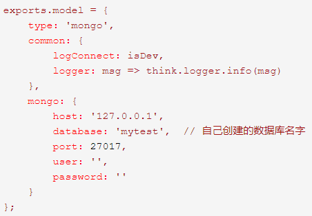
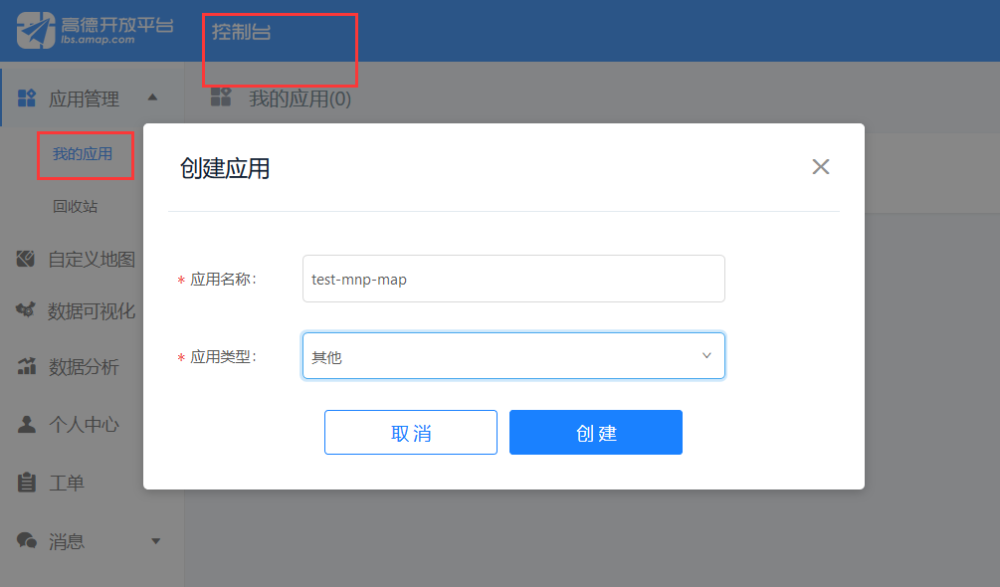
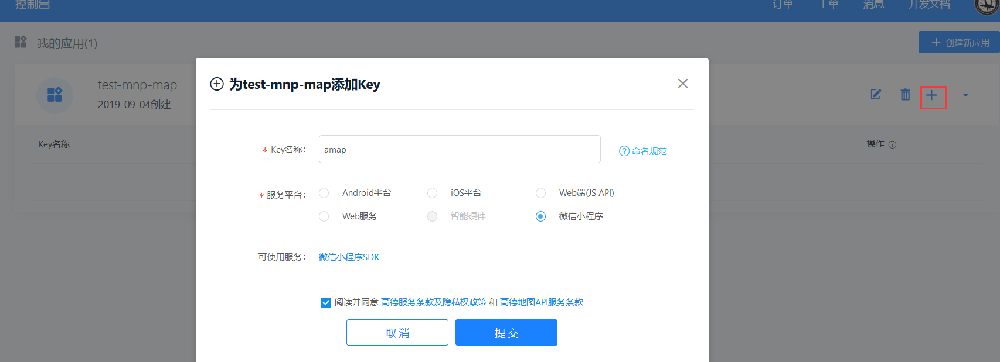
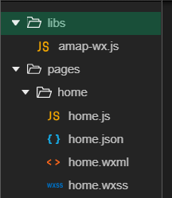
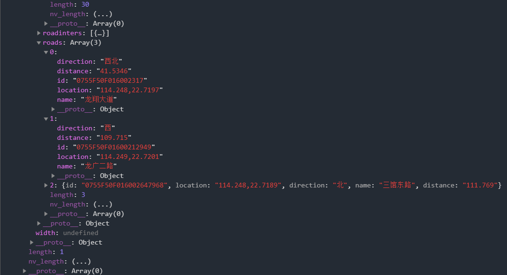

# Day2

### 参考

##### thinkjs框架

https://thinkjs.org/doc/index.html

# 后端服务

### 框架选择

- python + Thinkjs + mongodb
- python + flask + mongodb

## A 搭建一个后端项目

### Thinkjs

#### 安装环境

- 安装Node.js

  - 下载地址： https://nodejs.org/zh-cn/
        （选择LTS版）

- 验证下载  

  - 在终端下 查询版本号

  ```
      $ node -v
     
      $ npm -v
  ```

- 安装Thinkjs框架

  ```
      $ npm install -g think-cil
  ```

  - 验证下载

    - 查看think-cil版本号

      `thinkjs -V`

    - 若是从2.x升级，需将thinkjs删除后重新下载

      `$ npm uninstall -g thinkjs`

#### 创建项目

- 在项目目录的终端下创建项目

  ```
      $ thinkjs new [project_name];
  ```

  - 第一句执行后有四个问题  回车即默认
  - 执行后 关闭终端 再重新打开终端进行下一步

  ```
      $ cd [project_name];
  
      $ npm install;
      
      $ npm start;   
  ```

  - 执行完成后，会在控制台下看见类似日志

    

  - 验证创建完成

    - 访问 https://127.0.0.1:8360/
      - 若在远程主机上创建的项目，把ip地址换成对应地址

  - Thinkjs框架默认项目结构

    

------

### flask

- 为了操作方便，使用pycharm

#### 安装下载

- 安装flask连接mongodb专用包工具

  `pip install flask_pymongo`

- 导入相关包

  ```
      from flask import Flask,render_template
      # 导入轻量化的web框架flask
  
      from flask_pymongo import PyMongo
      # 导入第三方包flask_pymongo,连接mongodb
  ```

#### 启动程序

```
        if name == 'main':
            app.run(debug = True)
```

## B 实现后端项目与mongodb连接

### Thinkjs

#### 让框架支持mongdb

- 安装 ***think-mongo*** 模块

  `$ npm install think-mongo`

- 在项目的 ***config*** 目录下的 ***extend.js*** 文件中添加 ***think-mongo*** 模块

  ```
      const mongo = require('think-mongo');
  
      module.exports = [
          mongo(think.app)
      ]
  ```

#### 创建mongodb

- 在项目 ***根目录*** 下新建 ***db*** 目录，用于存放数据

  `mkdir db`

- 开启服务

  ```
      cd db
  
      mongod --dbpath=./
  ```

  - 以后也要在此目录下开启服务，否则后台连接不上服务器

#### 连接mongodb

- 修改 ***config*** 目录下的 ***adapter.js*** 文件

  

------

### flask

#### 配置环境

​   ```
        app = Flask(__name__)
        app.config['MONGO_URI'] = "mongodb://127.0.0.1:27017/db_name"
        # 实例化数据库配置，可以直接一行解决
​   ```

#### 实例化数据库

​   ```
        mongo = PyMongo(app)
​   ```

## C 通过后端实现对mongodb的CURD操作

### Thinkjs

#### 添加路由

- 在 ***controller*** 目录下

##### 修改初始页面

- ***index.js*** 文件 修改返回值

  ```
      module.exports = class extends Base {
          indexAction() {
              return this.display();
          }
      };
  ```

#### thinkjs 对 mongdb 的 CURD

https://thinkjs.org/zh-cn/doc/2.2/model_crud.html

#### thinkjs 特定 CURD 封装

https://thinkjs.org/zh-cn/doc/2.2/model_intro.html#toc-d84

- 在 ***controller*** 同级创建 ***model*** 目录 

  - 目录下 xx.js 即为 xx模型

  ```
      module.exports = class extends think.Mongo {
          aaa() {
              return this.model('user').select();
          };
      }
  ```

- 在 ***controller*** 下创建 ***xxx.js*** 

  - 即创建一个控制器

    ```
        const Base = require('./base.js');
    
        module.exports = class extends Base {
            async indexAction() {
                // 接收post请求传递的数据
                const bbb = this.post('request上传的key')
                // controller 中实例化模型 并调用自定义方法
                const user = await this.mongo('user').aaa();
                if (think.isEmpty(user)) {
                    return this.fail();
                } else {
                    return this.success(user);
                }
            }
        };
    ```

------

### flask

#### 添加路由

- 添加根页面api

  ```
      @app.route('/') # 路由 根目录
      def index():    
          # 测试数据库是否连接成功，如果成功就会返回Pymongo⼀一个游标对象。    
          onlines_users = mongo.db.system.users.find()
          word = '连接成功～'    
          return render_template('index.html')
   
  ```

#### flask 对 mongo 的 CURD

- 增

  ```
      @app.route('/add')
      def add():
          user = mongo.db.users
          username = "swper12222"
          userusername = user.find_one({"username":username})    
          if  userusername:        
              return "⽤用户已经存在！"    
          else:
              user.insert({"username": username, "password": "123456"})
              return "Added User!"
  
  ```

- 删

  ```
      @app.route('/delete/<username>')
      def delete(username):
          user = mongo.db.users    
          userusername = user.find_one({"username":username})    
          user.remove(userusername)    
          if userusername:        
              return "Remove " + userusername["username"] + " Ok!"    
          else:
              return "用户不不存在，请核对后再操作!"
  
  
  ```

- 改

  ```
      @app.route('/update/<username>')
      def update(username):
          user = mongo.db.users
          passwd = "abcd10023"
          userusername = user.find_one({"username":username})
          userusername["password"] = passwd
          user.save(userusername)
          return "Update OK " + userusername["username"]
  
  
  ```

- 查

  ```
      @app.route('/find/<username>')
      def find(username):
          user = mongo.db.users
          userusername = user.find_one({"username":username})
          if userusername:
              return "你查找的用户名：" + userusername["username"] + " 密码是：" + userusername["password"]    
          else:        
              return "你查找的⽤用户并不不存在!"
  
  ```


------
------

# 物流模拟

>参考  https://www.jianshu.com/p/e232c3c9af37
 
## D 使用小程序获取地理位置的Api

### 小程序获取位置信息

#### 实现流程

+ 获取权限

    >可以使用 ***wx.authorize*** 在调用需授权 API 之前，提前向用户发起授权请求。 这里没有

+ 获取地理位置信息

+ 根据获取到的数据，打开地图


#### 实现

+ 在 ***app.json*** 中配置

    ```
            "permission": {
                "scope.userLocation": {
                "desc": "你的位置信息将用于小程序位置接口的效果展示"
                }
            },
    ```

    

+ 在 ***xxx.js*** 中 配置

    + 在用户首次进入某页面（需要地理位置授权）时候，在页面进行 ***onLoad***，***onShow*** 时候，进行调用 ***wx.getLocation*** 要求用户进行授权；以后每次进入该页面时，通过 ***wx.getSetting*** 接口，返回用户授权具体信息。

    + 当该标志是 ***underfind***，表示用户初次进入该页面，当该标志是 ***false***，表示用户初次进入该页面拒绝了地理授权，应进行重新要求获取授权。

        

    + 配置代码如下

        ```
            data: {
                location:{}

            /**
            * 生命周期函数--监听页面加载
            */
            onLoad: function (options) {
                wx.getSetting({
                success: (res) => {
                    console.log(JSON.stringify(res))
                    // res.authSetting['scope.userLocation'] == undefined    表示 初始化进入该页面
                    // res.authSetting['scope.userLocation'] == false    表示 非初始化进入该页面,且未授权
                    // res.authSetting['scope.userLocation'] == true    表示 地理位置授权
                    if (res.authSetting['scope.userLocation'] != undefined && res.authSetting['scope.userLocation'] != true) {
                        wx.showModal({
                            title: '请求授权当前位置',
                            content: '需要获取您的地理位置，请确认授权',
                            success: function (res) {
                            if (res.cancel) {
                                wx.showToast({
                                title: '拒绝授权',
                                icon: 'none',
                                duration: 1000
                                })
                            } else if (res.confirm) {
                                wx.openSetting({
                                    success: function (dataAu) {
                                        if (dataAu.authSetting["scope.userLocation"] == true) {
                                        wx.showToast({
                                            title: '授权成功',
                                            icon: 'success',
                                            duration: 1000
                                        })
                                        //再次授权，调用wx.getLocation的API

                                        } else {
                                            wx.showToast({
                                                title: '授权失败',
                                                icon: 'none',
                                                duration: 1000
                                            })
                                        }
                                    }
                                })
                            }
                            }
                        })
                    } else if (res.authSetting['scope.userLocation'] == undefined) {
                    //调用wx.getLocation的API
                    wx.getLocation({
                        success: res => {
                            console.log(res);
                            this.setData({
                                location: res,
                            })
                            //console.log(app.globalData.location);
                        }
                    })
                    }
                    else {
                    //调用wx.getLocation的API
                    wx.getLocation({
                        success: res => {
                        console.log(res);
                        this.setData({
                            location: res,
                        })
                        }
                    })
                    }
                }
                })
            },
        ```
    + 设置函数打开地图

        ```
                openmap : function(){
                wx.openLocation({
                latitude: this.data.location.latitude,
                longitude: this.data.location.longitude,
                scale: 18,
                name:'位置名',
                address: '地址详情'
                })
            }
        ```

    + 实现效果

        

------

### 小程序调用高德地图api获取地理位置信息

> 微信小程序的接口，只能得到经纬度，但有时候我们需要得到具体的城市或者区域信息，这就需要借助高德地图了（或者腾讯地图等，逻辑都是一样的，但百度时间多可以试试）。

> 参考 高德 https://lbs.amap.com/api/wx/gettingstarted

#### 实现流程

+ 注册开发者
+ 获取key
+ 配置项目
    + 设置安全通讯域名
    + 下载api 
+ 调用api 获取数据
    + POI数据
    + 地址描述数据
    + 实时天气数据

#### 实现

##### 获取key

+ 进入控制台，创建新项目

    

+ 添加新key

    

+ 勾选后，在刚创建的项目下即可看到key

    

##### 配置项目

+ 设置安全通讯域名

    > 为了保证高德小程序 SDK 中提供的功能的正常使用，需要设置安全域名。

    + 登录微信公众平台(https://mp.weixin.qq.com/)，在 "设置"－>"开发设置" 中设置 ***request*** 合法域名，将 ***https://restapi.amap.com*** 中添加进去

        

    + 测试环境下

        + 开发者工具 - 详情 - 本地设置 - 勾选 不校验

        

+ 下载api https://lbs.amap.com/api/wx/download
    
    + 将解压后得到的 ***amap-wx.js*** 文件拷贝至 项目新建目录 ***libs*** 下

        

##### 调用api 获取数据

+ ***wxml*** 中使用<map></map>组件渲染地图

+ 在调用api的页面目录下的 ***xxx.js*** 文件中 引用 ***amap-wx.js***

    ```
        var amapFile = require('../../libs/amap-wx.js');
    ```
+ 实例化 ***AMapWX*** 对象

        ```
            var markersData = []; // 实例化AMapWX 对象
        ```

+ 为保证 ***marker*** 以自定义的图标显示，需在项目中新建 ***img*** 目录，并将 ***marker*** 对应的图标拷贝到项目的本地的 ***img*** 目录中，同时在 ***xxx.js*** 添加以下代码：

    ```
        Page({
        data: {

        },
        makertap: function(e) {
            var id = e.markerId;
            var that = this;
            that.showMarkerInfo(markersData,id);
            that.changeMarkerColor(markersData,id);
        },
        showMarkerInfo: function(data,i){
            var that = this;
            that.setData({
            textData: {
                name: data[i].name,
                desc: data[i].address
            }
            });
        },
        changeMarkerColor: function(data,i){
            var that = this;
            var markers = [];
            for(var j = 0; j < data.length; j++){
            if(j==i){
                data[j].iconPath = "选中 marker 图标的相对路径"; //如：..­/..­/img/marker_checked.png
            }else{
                data[j].iconPath = "未选中 marker 图标的相对路径"; //如：..­/..­/img/marker.png
            }
            markers.push(data[j]);
            }
            that.setData({
            markers: markers
            });
        }

        })
    ```

+ 调用 ***getPoiAround*** 方法，获取 ***POI*** 数据。

```
    onLoad: function() {
        var that = this;
        var myAmapFun = new amapFile.AMapWX({key:'您的key'});
        
        // 调用getPoiAround方法，获取Poi数据
        
        myAmapFun.getPoiAround({
        iconPathSelected: '选中 marker 图标的相对路径', //如：..­/..­/img/marker_checked.png
        iconPath: '未选中 marker 图标的相对路径', //如：..­/..­/img/marker.png
        success: function(data){
            markersData = data.markers;
            that.setData({
            markers: markersData
            });
            that.setData({
            latitude: markersData[0].latitude
            });
            that.setData({
            longitude: markersData[0].longitude
            });
            that.showMarkerInfo(markersData,0);
        },
        fail: function(info){
            wx.showModal({title:info.errMsg})
        }
        })
    },
```

+ 获取返回值

    

+ 调用 ***getRegeo*** 方法，获取 ***地址描述数据***

    >onLoad 中

    ```
        myAmapFun.getRegeo({
            success: function (data) {
            //成功回调
            console.log(data)
            },
            fail: function(info){
            //失败回调 
            console.log(info)
            }
        })

    ```

    + 获取返回值

        
        
        
    
+ 调用 ***getWeather*** 方法，获取 ***实时天气数据***

    > onLoad 中
    
    ```
        myAmapFun.getWeather({
            success: function (data) {
            //成功回调
            console.log(data)
            },
            fail: function(info){
            //失败回调
            console.log(info)
            }
        })
    ```
    + 获取返回值

        

## E 编写地理信息存储Api

>   以从高德地图api的数据为例
>   address latitude longitude name

```
    Page({
        data:{
            address:'', //地址
            latitude:'',  //经度
            longitude:'',  //纬度
            name:''  // 名字
        },
        xxx: function () {
            let that = this
            wx.request({
                //https 需要ssl 测试环境不加s
                url: 'http://127.0.0.1:端口号/控制器名/函数名',
                method: 'post',
                data: {
                    // 上传参数
                    address:that.data.address,
                    latitude:that.data.latitude,
                    longitude:that.data.longitude,
                    name:that.data.name
                },
                success(res) {
                //成功回调函数
                }
            })
        }
    })
    
```

## F 小程序中整合二维码扫描功能

> 官方文档： https://mp.weixin.qq.com/debug/wxadoc/dev/api/scancode.html

+ 扫码返回参数

    + res.result   // 数据
    + res.scanType // 二维码类型
    + res.charSet  // 字符集
    + res.path     // 路径

```
    Page({
    data: {
        show: {},
    },
    click: function () {
        var that = this;
        wx.scanCode({       // 调用扫码api
            success: (res) => {
                that.setData({
                    show: res
                })
                wx.showToast({
                    title: '成功',
                    icon: 'success',
                    duration: 2000
                })
            },
            fail: (res) => {
                wx.showToast({
                    title: '失败',
                    icon: 'success',
                    duration: 2000
                })
            },
            complete: (res) => {
            }  
        })
    }
    })

```

## G 生成一个二维码保存自己的信息（姓名、学号等）扫码后发送post请求保存这些数据

### 生成一个二维码

+ https://cli.im/ - 草料二维码

### 扫码后 将数据post给后端

#### 参考 E

## H 后端对个人信息数据进行接收，存储到数据库中

#### 参考 C - thinkjs 特定 CURD 封装

------

# Day 4


## a.设计二维码

## 参阅

https://cli.im/ - 草料二维码


## b.获取位置信息

## 目标

1. 完成对地图接口的调用，返回相关的调用结果

## 实现介绍

> 本实例中使用百度地图的API http://lbsyun.baidu.com/

有关小程序调用 API 部分，请参考官方文档 http://lbsyun.baidu.com/index.php?title=wxjsapi

本实例中使用了天气查询功能

添加给定的代码到小程序中，返回一串json格式的值给客户端

```
{weatherData: "城市：深圳市
 			  PM2.5：27
 			  日期：周二 09月03日 (实时：29℃)
 			  温度：31 ~ 26℃
 			  天气：阵雨
 			  风力：无持续风向微风", 
 allresult: "", 
 __webviewId__: 0}
```


## c.扫描获取二维码中的信息

## 目标

1. 在小程序中使用扫描获取二维码包含的信息
2. 将获取的二维码信息和位置信息发送给后端

## 实现介绍

使用 `wx.scanCode` 方法调起客户端扫码界面进行扫码

| 属性名  |          含义          |
| :-----: | :--------------------: |
| success | 接口调用成功的回调函数 |
|  fail   | 接口调用失败的回调函数 |

`success` 的回调函数中，包含返回结果 `res`  。

`res` Object 属性

| 属性名 |     含义     |
| :----: | :----------: |
| result | 所扫码的内容 |

获取到二维码信息后，定义一个全局列表变量 `allresult : {}`

将它与位置信息一起添加到 `allresult` 

扫码成功后发起请求，在 `wx.scanCode` 的  `success` 回调函数内添加 `wx.request` 方法

通过 `wx.request` 方法发起 POST 请求

将数据传给后端统一保存


## d.后端接收保存数据

## 目标

1. 接收前端发送的数据请求
2. 将数据保存在数据库中

## 实现介绍

1. 创建相应数据库（mongoDB）

   > 这里创建数据库与集合用来存储前端传回的信息

```
use weather
db.createCollection("user")
```

2. 设计接口（后端使用 ThinkJS 实现）

   test.js

   ```
   const Base = require("./base.js");
   
   module.exports = class extends Base {
       async indexAction() {
               const data = this.post('data');
               console.log(data)
               const a = await this.mongo('user').add(data);
               console.log(a);
               return this.success('success');
       }
   
       async addAction() {
               const test = 'hahaha';
               return this.json({test});
       }
   };
   
   ```

   3.效果图（数据库中前端发送的数据）

   

**代码样例：**

[index.js](https://github.com/xpcloud/baidu-map-miniprogramer/blob/master/pages/index/index.js)


调用百度地图 `API` 来获取位置信息


