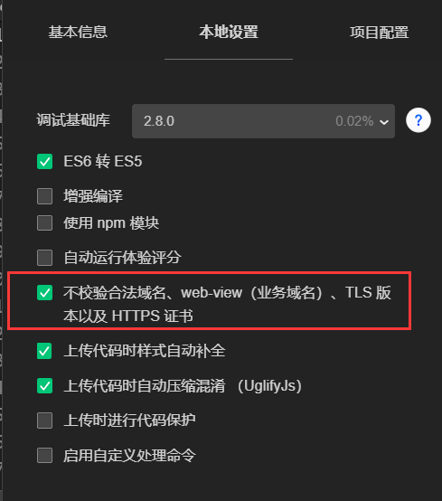
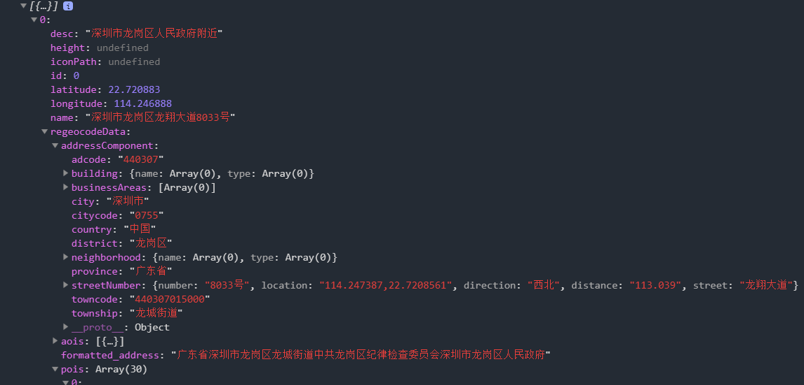
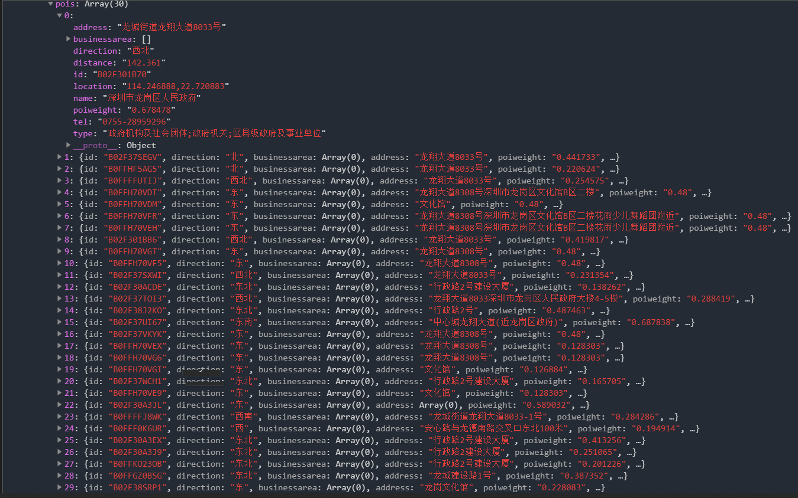

[TOC]

# Day1

## 一、搭建Mongodb环境并建立表存储温度数据
### 1. 搭建环境：Ubuntu 18.04

#### 1.1. 安装下载
      sudo apt-get install mongodb
#### 1.2. 启动服务
      mongod
#### 1.3. 登陆客户端
      mongo
#### 1.4. 建立demo数据库并在其中添加存有温度信息的表
     use demo
     db.createCollection("tmp")
     db.tmp.insert({place:‘placeA’,tmp:20,time:20190901.0700})
     db.tmp.insert({place:‘placeA’,tmp:30,time:20190901.1200})
     db.tmp.insert({place:‘placeA’,tmp:24,time:20190901.2300})

### 2. 下载地址
 https://robomongo.org/down
### 3. 具体安装流程参考
 https://www.jianshu.com/p/2a76fb6e4f8b

## 二、搭建三个节点的分布式数据库

### 1. 端口分配
     27018：config server（master）
     27019：config server（slave）
     27020：config arbiter
     27021：shard_master
     27022：shard_slave
     27023：shard_arbiter
     27024：shard2_master
     27025: shard2_slave
     27026: shard2_arbiter
     27027：router


集群说明：
      

    Config集群：保存数据的大小，类型，存储等信息，不存放实际数据
    shard和shard2集群：存放实际数据的集群，其中,slave和arbiter分片为备用分片，当master分片运行异常时启动
    router节点：路由节点挂，在该节点下插入的数据将依照相应的分片规则自动分配在该节点下注册过的集群中

### 2. 搭建流程
#### 2.1. 搭建config集群
~~~
1.新建文件夹在该文件下添加config集群的文件夹和相关配置文件
2.在配置文件中写入如下代码，以confiMaster.conf为例子
directoryperdb=true
replSet=config
configsvr=true
logpath=/home/pdx/myMongodb/config_master/mongod.log
logappend=true
fork=true
port=27018
dbpath=/home/pdx/myMongodb/config_master
pidfilepath=/home/pdx/myMongodb/config_master/mongod.pid
3.启动服务
mongod -f configMaster.conf
mongod -f configSlave.conf
mongod -f configAlbiter.conf
~~~
- 在主节点上注册分片信息
~~~
mongo --port 27018
use admin
cfg={_id:"config",members:[{_id:0,host:'127.0.0.1:27018',priority:2}，
{_id:1,host:'127.0.0.1:27019',priority:1},
{_id:2,host:’127.0.0.1’,priority:2}]};
rs.initiale(cfg)
~~~
- 在从节点上保存
~~~
mongo --port 27019
use admin
rs.slaveOK()
~~~
- 配置shard和shard2分片集群
~~~
步骤与配置config集群相同
需要在配置文件中修改相应的参数
配置文件编写好后启动服务
登录主节点注册
在从节点上开启
~~~

- 配置router节点
~~~
新建router文件夹和router.conf配置文件
往router.conf文件中写入如下信息
configdb = config/127.0.0.1:27019,127.0.0.1:27018                           
logpath=/home/pdx/myMongodb/router/mongod.log
logappend=true
fork=true
port=27027
pidfilepath=/home/pdx/myMongodb/router/mongod.pid 
使用mongos启动router节点
mongos --f router.conf
~~~
- 配置具体的分片规则
~~~
登陆router节点
mongo --port 27027
添加分片划分信息
use admin
sh.addShard("shard/127.0.0.1:27021，127.0.0.1:27022,127.0.0.1:27023")
sh.addShard("shard2/127.0.0.1:27024,127.0.0.1:27025,127.0.0.1:27026")
指定分片的数据库
sh.enableSharding("test")
指定要进行分片的表和具体的分片规则
sh.shardCollection("test.t",{id:"hashed"})
创建索引
db.t.getIndexes()
~~~
- 插入数据并进行验证
~~~
use test
for(i=1,i<=1000,i++){db.t.insert({id:i,name:"Lihua"})}
登陆shard_master节点和shard2_master节点进行验证
db.t.count()
~~~
**mongodb分布式数据库搭建完成**

### 3. 测试Mongodb数据库性能
- 测试工具
- mongo-mload
- 下载地址
https://github.com/eshujiushiwo/mongo-mload

- 环境配置
文件为go语言的源文件，需安装go语言环境，并安装mongodb驱动 go get gopkg.in/mgo.v2/bson

- 测试指令

      --host              压测目标（如127.0.0.1）
      --port    	       压测端口（default 27017）
      --db             操作数据库名称（默认mongobench）
      --collection             操作数据库表（默认data_test）
      --userName         用户名（如果有）
      --passWord         密码（如果有）
      --cpunum	       多核设定（默认1）
      --procnum	       压测并发个数（默认4）
      --datanum	       每个线程插入数据条数（默认10000）
      --logpath	       日志路径（默认./log.log）
      --jsonfile	       希望插入document路径（不选用该参数则使用默认的插入格式）
      --operation	       压测模式（insert,prepare,query,tps,update）prepare模式会在插入完成后为查询会用的项添加索引
      --queryall	       压测模式为query的时候，是否返回所有查询到的结果（默认false，即db.xx.findOne()）
      --clean		       是否清理数据(默认false，如果为true将drop数据库mongobench)
      --geo          是否进行空间地理数据的测试（默认false, 即普通查询和索引；true 则使用经纬度类型数据进行查询）
      --geofield          空间地理查询测试使用的2d sphere字段名称（默认 loc）
  
#### 3.1. 对刚搭建好的数据库进行测试
- 插入测试
~~~
清理数据库
go run mload.go --host 127.0.0.1 --clean true
使用8核cpu，8个并发，每个并发插入100000条数据，日志输入为/tmp/log.log，插入的每条数据为./test_data.json中的内容
go run mload.go --host 127.0.0.1 --datanum 100000 --procnum 8 --cpunum 8 --jsonfile ./test_data.json --operation insert
~~~
- 查询测试
~~~
清理数据库
go run mload.go --host 127.0.0.1 --clean true
Limite one 测试
go run mload.go --host 127.0.0.1 --datanum 1000000 --procnum 8 --cpunum 8 --operation query
非limite one 测试
go run mload.go --host 127.0.0.1 --datanum 1000000 --procnum 8 --cpunum 8 --operation query  --queryall true
~~~
- 读写测试
~~~
清理数据库
go run mload.go --host 127.0.0.1 --clean true
准备数据
go run mload.go --host 127.0.0.1 --datanum 1000000 --procnum 1 --logpath /tmp/log.log --operation prepare
测试		
go run mload.go --host 127.0.0.1 --datanum 1000000 --procnum 1 --logpath /tmp/log.log --operation tps
~~~

- 更新测试
~~~
清理数据库
go run mload.go --host 127.0.0.1 --clean true
准备数据
go run mload.go --host 127.0.0.1 --datanum 10 --procnum 1 --operation prepare
update测试
go run mload.go --host 127.0.0.1 --datanum 1 --procnum 10 --operation update
~~~


# Day2

## 一、参考

### 1. thinkjs框架

https://thinkjs.org/doc/index.html

### 2. 物流模拟

https://www.jianshu.com/p/e232c3c9af37

## 二、后端服务

### 1. 框架选择

- python + Thinkjs + mongodb
- python + flask + mongodb

## 三、搭建一个后端项目

### 1. Thinkjs

#### 1.1. 安装环境

- 安装Node.js

  - 下载地址： https://nodejs.org/zh-cn/
        （选择LTS版）

- 验证下载  

  - 在终端下 查询版本号

  ```
      $ node -v
     
      $ npm -v
  ```

- 安装Thinkjs框架

  ```
      $ npm install -g think-cil
  ```

  - 验证下载

    - 查看think-cil版本号

      `thinkjs -V`

    - 若是从2.x升级，需将thinkjs删除后重新下载

      `$ npm uninstall -g thinkjs`

#### 1.2. 创建项目

- 在项目目录的终端下创建项目

  ```
      $ thinkjs new [project_name];
  ```

  - 第一句执行后有四个问题  回车即默认
  - 执行后 关闭终端 再重新打开终端进行下一步

  ```
      $ cd [project_name];
  
      $ npm install;
      
      $ npm start;   
  ```

  - 执行完成后，会在控制台下看见类似日志

    

  - 验证创建完成

    - 访问 https://127.0.0.1:8360/
      - 若在远程主机上创建的项目，把ip地址换成对应地址

  - Thinkjs框架默认项目结构

    

------

### 2. flask

- 为了操作方便，使用pycharm

#### 2.1. 安装下载

- 安装flask连接mongodb专用包工具

  `pip install flask_pymongo`

- 导入相关包

  ```
      from flask import Flask,render_template
      # 导入轻量化的web框架flask
  
      from flask_pymongo import PyMongo
      # 导入第三方包flask_pymongo,连接mongodb
  ```

#### 2.2. 启动程序

```
        if name == 'main':
            app.run(debug = True)
```

## 四、实现后端项目与mongodb连接

### 1. Thinkjs

#### 1.1. 让框架支持mongdb

- 安装 ***think-mongo*** 模块

  `$ npm install think-mongo`

- 在项目的 ***config*** 目录下的 ***extend.js*** 文件中添加 ***think-mongo*** 模块

  ```
      const mongo = require('think-mongo');
  
      module.exports = [
          mongo(think.app)
      ]
  ```

#### 1.2. 创建mongodb

- 在项目 ***根目录*** 下新建 ***db*** 目录，用于存放数据

  `mkdir db`

- 开启服务

  ```
      cd db
  
      mongod --dbpath=./
  ```

  - 以后也要在此目录下开启服务，否则后台连接不上服务器

#### 1.3. 连接mongodb

- 修改 ***config*** 目录下的 ***adapter.js*** 文件

  

------

### 2. flask

#### 2.1. 配置环境

   ```
        app = Flask(__name__)
        app.config['MONGO_URI'] = "mongodb://127.0.0.1:27017/db_name"
        # 实例化数据库配置，可以直接一行解决
​   ```

#### 实例化数据库

   ```
        mongo = PyMongo(app)
​   ```

## 五、通过后端实现对mongodb的CURD操作

### 1. Thinkjs

#### 1.1. 添加路由

- 在 ***controller*** 目录下

#### 1.2. 修改初始页面

- ***index.js*** 文件 修改返回值

  ```
      module.exports = class extends Base {
          indexAction() {
              return this.display();
          }
      };
  ```

#### 1.3. thinkjs 对 mongdb 的 CURD

https://thinkjs.org/zh-cn/doc/2.2/model_crud.html

#### 1.4. thinkjs 特定 CURD 封装

https://thinkjs.org/zh-cn/doc/2.2/model_intro.html#toc-d84

- 在 ***controller*** 同级创建 ***model*** 目录 

  - 目录下 xx.js 即为 xx模型

  ```
      module.exports = class extends think.Mongo {
          aaa() {
              return this.model('user').select();
          };
      }
  ```

- 在 ***controller*** 下创建 ***xxx.js*** 

  - 即创建一个控制器

    ```
        const Base = require('./base.js');
    
        module.exports = class extends Base {
            async indexAction() {
                // 接收post请求传递的数据
                const bbb = this.post('request上传的key')
                // controller 中实例化模型 并调用自定义方法
                const user = await this.mongo('user').aaa();
                if (think.isEmpty(user)) {
                    return this.fail();
                } else {
                    return this.success(user);
                }
            }
        };
    ```

------

### 2. flask

#### 2.1. 添加路由

- 添加根页面api

  ```
      @app.route('/') # 路由 根目录
      def index():    
          # 测试数据库是否连接成功，如果成功就会返回Pymongo⼀一个游标对象。    
          onlines_users = mongo.db.system.users.find()
          word = '连接成功～'    
          return render_template('index.html')
   
  ```

#### 2.2. flask 对 mongo 的 CURD

- 增

  ```
      @app.route('/add')
      def add():
          user = mongo.db.users
          username = "swper12222"
          userusername = user.find_one({"username":username})    
          if  userusername:        
              return "⽤用户已经存在！"    
          else:
              user.insert({"username": username, "password": "123456"})
              return "Added User!"
  
  ```

- 删

  ```
      @app.route('/delete/<username>')
      def delete(username):
          user = mongo.db.users    
          userusername = user.find_one({"username":username})    
          user.remove(userusername)    
          if userusername:        
              return "Remove " + userusername["username"] + " Ok!"    
          else:
              return "用户不不存在，请核对后再操作!"
  
  
  ```

- 改

  ```
      @app.route('/update/<username>')
      def update(username):
          user = mongo.db.users
          passwd = "abcd10023"
          userusername = user.find_one({"username":username})
          userusername["password"] = passwd
          user.save(userusername)
          return "Update OK " + userusername["username"]
  
  
  ```

- 查

  ```
      @app.route('/find/<username>')
      def find(username):
          user = mongo.db.users
          userusername = user.find_one({"username":username})
          if userusername:
              return "你查找的用户名：" + userusername["username"] + " 密码是：" + userusername["password"]    
          else:        
              return "你查找的⽤用户并不不存在!"
  
  ```

------
------


## 六、使用小程序获取地理位置的Api

### 1. 小程序获取位置信息

#### 1.1. 实现流程

+ 获取权限

    >可以使用 ***wx.authorize*** 在调用需授权 API 之前，提前向用户发起授权请求。 这里没有

+ 获取地理位置信息

+ 根据获取到的数据，打开地图


#### 1.2. 实现方法

+ 在 ***app.json*** 中配置

    ```
            "permission": {
                "scope.userLocation": {
                "desc": "你的位置信息将用于小程序位置接口的效果展示"
                }
            },
    ```

    

+ 在 ***xxx.js*** 中 配置

    + 在用户首次进入某页面（需要地理位置授权）时候，在页面进行 ***onLoad***，***onShow*** 时候，进行调用 ***wx.getLocation*** 要求用户进行授权；以后每次进入该页面时，通过 ***wx.getSetting*** 接口，返回用户授权具体信息。

    + 当该标志是 ***underfind***，表示用户初次进入该页面，当该标志是 ***false***，表示用户初次进入该页面拒绝了地理授权，应进行重新要求获取授权。

        

    + 配置代码如下

        ```
            data: {
                location:{}

            /**
            * 生命周期函数--监听页面加载
            */
            onLoad: function (options) {
                wx.getSetting({
                success: (res) => {
                    console.log(JSON.stringify(res))
                    // res.authSetting['scope.userLocation'] == undefined    表示 初始化进入该页面
                    // res.authSetting['scope.userLocation'] == false    表示 非初始化进入该页面,且未授权
                    // res.authSetting['scope.userLocation'] == true    表示 地理位置授权
                    if (res.authSetting['scope.userLocation'] != undefined && res.authSetting['scope.userLocation'] != true) {
                        wx.showModal({
                            title: '请求授权当前位置',
                            content: '需要获取您的地理位置，请确认授权',
                            success: function (res) {
                            if (res.cancel) {
                                wx.showToast({
                                title: '拒绝授权',
                                icon: 'none',
                                duration: 1000
                                })
                            } else if (res.confirm) {
                                wx.openSetting({
                                    success: function (dataAu) {
                                        if (dataAu.authSetting["scope.userLocation"] == true) {
                                        wx.showToast({
                                            title: '授权成功',
                                            icon: 'success',
                                            duration: 1000
                                        })
                                        //再次授权，调用wx.getLocation的API

                                        } else {
                                            wx.showToast({
                                                title: '授权失败',
                                                icon: 'none',
                                                duration: 1000
                                            })
                                        }
                                    }
                                })
                            }
                            }
                        })
                    } else if (res.authSetting['scope.userLocation'] == undefined) {
                    //调用wx.getLocation的API
                    wx.getLocation({
                        success: res => {
                            console.log(res);
                            this.setData({
                                location: res,
                            })
                            //console.log(app.globalData.location);
                        }
                    })
                    }
                    else {
                    //调用wx.getLocation的API
                    wx.getLocation({
                        success: res => {
                        console.log(res);
                        this.setData({
                            location: res,
                        })
                        }
                    })
                    }
                }
                })
            },
        ```
    + 设置函数打开地图

        ```
                openmap : function(){
                wx.openLocation({
                latitude: this.data.location.latitude,
                longitude: this.data.location.longitude,
                scale: 18,
                name:'位置名',
                address: '地址详情'
                })
            }
        ```

    + 实现效果

        

------

### 2. 小程序调用高德地图api获取地理位置信息

> 微信小程序的接口，只能得到经纬度，但有时候我们需要得到具体的城市或者区域信息，这就需要借助高德地图了（或者腾讯地图等，逻辑都是一样的，但百度时间多可以试试）。

> 参考 高德 https://lbs.amap.com/api/wx/gettingstarted

#### 2.1. 实现流程

+ 注册开发者
+ 获取key
+ 配置项目
    + 设置安全通讯域名
    + 下载api 
+ 调用api 获取数据
    + POI数据
    + 地址描述数据
    + 实时天气数据

#### 2.2. 实现方法

##### 2.2.1. 获取key

+ 进入控制台，创建新项目

    

+ 添加新key

    

+ 勾选后，在刚创建的项目下即可看到key

    

##### 2.2.2. 配置项目

+ 设置安全通讯域名

    > 为了保证高德小程序 SDK 中提供的功能的正常使用，需要设置安全域名。

    + 登录微信公众平台(https://mp.weixin.qq.com/)，在 "设置"－>"开发设置" 中设置 ***request*** 合法域名，将 ***https://restapi.amap.com*** 中添加进去

        

    + 测试环境下

        + 开发者工具 - 详情 - 本地设置 - 勾选 不校验

        

+ 下载api https://lbs.amap.com/api/wx/download
  
    + 将解压后得到的 ***amap-wx.js*** 文件拷贝至 项目新建目录 ***libs*** 下

        

##### 2.2.3. 调用api 获取数据

+ ***wxml*** 中使用<map></map>组件渲染地图

+ 在调用api的页面目录下的 ***xxx.js*** 文件中 引用 ***amap-wx.js***

    ```
        var amapFile = require('../../libs/amap-wx.js');
    ```
+ 实例化 ***AMapWX*** 对象

        ```
            var markersData = []; // 实例化AMapWX 对象
        ```

+ 为保证 ***marker*** 以自定义的图标显示，需在项目中新建 ***img*** 目录，并将 ***marker*** 对应的图标拷贝到项目的本地的 ***img*** 目录中，同时在 ***xxx.js*** 添加以下代码：

    ```
        Page({
        data: {

        },
        makertap: function(e) {
            var id = e.markerId;
            var that = this;
            that.showMarkerInfo(markersData,id);
            that.changeMarkerColor(markersData,id);
        },
        showMarkerInfo: function(data,i){
            var that = this;
            that.setData({
            textData: {
                name: data[i].name,
                desc: data[i].address
            }
            });
        },
        changeMarkerColor: function(data,i){
            var that = this;
            var markers = [];
            for(var j = 0; j < data.length; j++){
            if(j==i){
                data[j].iconPath = "选中 marker 图标的相对路径"; //如：..­/..­/img/marker_checked.png
            }else{
                data[j].iconPath = "未选中 marker 图标的相对路径"; //如：..­/..­/img/marker.png
            }
            markers.push(data[j]);
            }
            that.setData({
            markers: markers
            });
        }

        })
    ```

+ 调用 ***getPoiAround*** 方法，获取 ***POI*** 数据。

```
    onLoad: function() {
        var that = this;
        var myAmapFun = new amapFile.AMapWX({key:'您的key'});
        
        // 调用getPoiAround方法，获取Poi数据
        
        myAmapFun.getPoiAround({
        iconPathSelected: '选中 marker 图标的相对路径', //如：..­/..­/img/marker_checked.png
        iconPath: '未选中 marker 图标的相对路径', //如：..­/..­/img/marker.png
        success: function(data){
            markersData = data.markers;
            that.setData({
            markers: markersData
            });
            that.setData({
            latitude: markersData[0].latitude
            });
            that.setData({
            longitude: markersData[0].longitude
            });
            that.showMarkerInfo(markersData,0);
        },
        fail: function(info){
            wx.showModal({title:info.errMsg})
        }
        })
    },
```

+ 获取返回值

    

+ 调用 ***getRegeo*** 方法，获取 ***地址描述数据***

    >onLoad 中

    ```
        myAmapFun.getRegeo({
            success: function (data) {
            //成功回调
            console.log(data)
            },
            fail: function(info){
            //失败回调 
            console.log(info)
            }
        })

    ```

    + 获取返回值

        
        
        
    
+ 调用 ***getWeather*** 方法，获取 ***实时天气数据***

    > onLoad 中
    
    ```
        myAmapFun.getWeather({
            success: function (data) {
            //成功回调
            console.log(data)
            },
            fail: function(info){
            //失败回调
            console.log(info)
            }
        })
    ```
    + 获取返回值

        

## 七、编写地理信息存储Api

>   以从高德地图api的数据为例
>   address latitude longitude name

```
    Page({
        data:{
            address:'', //地址
            latitude:'',  //经度
            longitude:'',  //纬度
            name:''  // 名字
        },
        xxx: function () {
            let that = this
            wx.request({
                //https 需要ssl 测试环境不加s
                url: 'http://127.0.0.1:端口号/控制器名/函数名',
                method: 'post',
                data: {
                    // 上传参数
                    address:that.data.address,
                    latitude:that.data.latitude,
                    longitude:that.data.longitude,
                    name:that.data.name
                },
                success(res) {
                //成功回调函数
                }
            })
        }
    })
    
```

## 八、小程序中整合二维码扫描功能

> 官方文档： https://mp.weixin.qq.com/debug/wxadoc/dev/api/scancode.html

+ 扫码返回参数

    + res.result   // 数据
    + res.scanType // 二维码类型
    + res.charSet  // 字符集
    + res.path     // 路径

```
    Page({
    data: {
        show: {},
    },
    click: function () {
        var that = this;
        wx.scanCode({       // 调用扫码api
            success: (res) => {
                that.setData({
                    show: res
                })
                wx.showToast({
                    title: '成功',
                    icon: 'success',
                    duration: 2000
                })
            },
            fail: (res) => {
                wx.showToast({
                    title: '失败',
                    icon: 'success',
                    duration: 2000
                })
            },
            complete: (res) => {
            }  
        })
    }
    })

```

## 九、传递数据到后端

### 1. 生成一个二维码

+ https://cli.im/ - 草料二维码

扫码后 将数据post给后端
参考 **7 - 编写地理信息存储API**

## 十、后端对个人信息数据进行接收，存储到数据库中

参考 **5.1.4 - thinkjs 特定 CURD 封装**

------


# Day 3

## 一、微信小程序调用地图api

### 1. 准备工作

   基本流程

1. 注册账号
2. 申请开发者密钥
3. 下载SDK 

百度地图开发者平台:http://lbsyun.baidu.com

### 2. 环境配置

1. 创建本地小程序项目

2. 引入js模块

   在根目录下创建一个路径，下载百度地图微信小程序JavaScriptAPI，解压后的文件中有 bmap-wx.js 文件(压缩版 bmap-wx.min.js )，将其拷贝到新建的路径下，安装完成。

3. 请求合法域名

   登录微信公众平台－> "设置" －> "开发设置" －> "request 合法域名" －>添加 api.map.baidu.com －> 点击"保存并提交"。

### 3. 实现方法

本案例使用百度地图的**地址解析API**

**原理：** 

1. 引用百度地图微信小程序JavaScript API 模块
2. 在页面的onLoad中声明BMapWX对象
3. 调用BMapWX.geocoding方法进行地址解析

**参阅：**

[百度地图地址解析](https://lbs.baidu.com/index.php?title=wxjsapi/guide/geocoding)


## 二、百度地图获取数据库表中信息的坐标显示在地图上

### 1. index.js代码

```
   //通用封装好的js:

var map = new BMap.Map("container"); //建树Map实例
var point = new BMap.Point(103.976032, 33.845509); // 建树点坐标
map.centerAndZoom(point, 6); // 初始化地图,设置中心点坐标和地图级别。
//地图事件设置函数：
map.enableDragging(); //启用地图拖拽事件，默认启用(可不写)
map.enableScrollWheelZoom(); //启用地图滚轮放大缩小
map.enableDoubleClickZoom(); //启用鼠标双击放大，默认启用(可不写)
map.enableKeyboard(); //启用键盘上下左右键移动地图

//向地图中添加缩放控件
var ctrl_nav = new BMap.NavigationControl({ anchor: BMAP_ANCHOR_TOP_LEFT, type: BMAP_NAVIGATION_CONTROL_LARGE });
map.addControl(ctrl_nav);
//向地图中添加缩略图控件
var ctrl_ove = new BMap.OverviewMapControl({ anchor: BMAP_ANCHOR_BOTTOM_RIGHT, isOpen: 1 });
map.addControl(ctrl_ove);
//向地图中添加比例尺控件
var ctrl_sca = new BMap.ScaleControl({ anchor: BMAP_ANCHOR_BOTTOM_LEFT });
map.addControl(ctrl_sca);
//创建marker
function addMarker() {
    for (var i = 0; i < markerArr.length; i++) {
        var json = markerArr[i];
        var p0 = json.point.split("|")[0];
        var p1 = json.point.split("|")[1];
        var point = new BMap.Point(p0, p1);
        
        var iconImg = createIcon(json.icon);
        var marker = new BMap.Marker(point, { icon: iconImg });
        map.addOverlay(marker);
    }
}
//创建一个Icon
function createIcon(json) {
    // 创建图标对象   
        //var myIcon = new BMap.Icon("../marker_red_sprite.png", new BMap.Size(23, 25), {
        //    // 指定定位位置。   
        //    // 当标注显示在地图上时，其所指向的地理位置距离图标左上    
        //    // 角各偏移10像素和25像素。您可以看到在本例中该位置即是   
        //    // 图标中央下端的尖角位置。    
        //    offset: new BMap.Size(10, 25),    
        //    // 设置图片偏移。   
        //    // 当您需要从一幅较大的图片中截取某部分作为标注图标时，您   
        //    // 需要指定大图的偏移位置，此做法与css sprites技术类似。    
        //    //imageOffset: new BMap.Size(0, 0 - index * 25)   // 设置图片偏移    
        //});
    var icon = new BMap.Icon(图片名称, new BMap.Size(json.w, json.h), { imageOffset: new BMap.Size(-json.l, -json.t), infoWindowOffset: new BMap.Size(json.lb + 5, 1), offset: new BMap.Size(json.x, json.h) })
    return icon;
}
```

### 2. 获取数据库数据

```
<html>
 <head>
  <title>百度地图加载</title>
 </head>
 <script src="Map.js"></script>
 <script type="text/javascript"> 
    
    //声明全局数组
    var markerArr = [];
    $(function () {
        //点击查询加载标注
        $("#btnSearch").click(function () {
            LoadMap();
        });

    });

    //加载游客地理位置
    function LoadMap() {
       //清空数组和所有标注点
        markerArr = [];
        map.clearOverlays();
        var par={
            startDate:$("#startDate").val(),
            endDate:$("#endDate").val()
        }
        $.ajax({
            type: "get",
            url: "/VisitorClient/GetAllInfo",
            data: par,
            dataType:"json",
            cache: false,
            success: function (r) {
                if (r.res) { 
                    dataBind(r);
                    $("#spannum").text("该时段App园区游客人数为：" + r.count);
                }
                else {
                    $("#spannum").text("该时段园区没有人使用App");
                }
                
            },
            error: function (d)
            {
                
                alert(d.responseText);
            }
        });    
    }
    function dataBind(r) {
        $.map(r.data, function (d) {
            
            var arr = { point: "" + d.Longitude + "|" + d.Latitude };
            markerArr.push(arr);
        });
        addMarker();
    }

</script>
 <body>
  <input type="button" value="搜索" id="btnSearch"/>
 </body>
</html>
```

## 三、在小程序中使用echarts组件

### 1. 实现方法

1. 下载 GitHub 上的 ecomfe/echarts-for-weixin 项目，下载后将ec-canvas文件夹复制到小程序项目中，假设放在根目录下utils文件夹中。

2. 在要实现echarts图的页面引入echarts.js文件，例如要在index页面中展现echarts图的话，就在index.js文件中引入。

   `import * as echarts from '../../utils/ec-canvas/echarts';`

3. 在index.json中设置使用组件组件。

```
{
	"usingComponents": {
		"ec-canvas": "../../utils/ec-canvas/ec-canvas"
	}
}
```

4. 在index.wxml中使用组件<ec-canvas>

```
<view class='radar' style="width: 500rpx; height: 500rpx;">
	<ec-canvas id="mychart-dom-radar" canvas-id='mychart-line' ec="{{ec}}"></ec-canvas>
</view>
```

5. 在index.js中实现echarts具体设置，具体设置可参考echarts配置项手册和官方实例

```
function getOption(xData, data_cur, data_his) {
  var option = {
    backgroundColor: "#f5f4f3",
    color: ["#37A2DA", "#f2960d", "#67E0E3", "#9FE6B8"],
    title: {
      text: '温度变化',
      textStyle: {
        fontWeight: '500',
        fontSize: 15,
        color: '#000'
      },
      x:'center',
      y:'0'
    },
    legend: {
      data: ['今日'],
      right: 10
    },
    grid: {
      top: '15%',
      left: '1%',
      right: '3%',
      bottom: '60rpx',
      containLabel: true
    },
    tooltip: {
      show: true,
      trigger: 'axis'
    },
    xAxis: {
      type: 'time',
      boundaryGap: false,
      data: xData||[],
      axisLabel: {
        interval: 11,
        formatter: function (value, index) {
          return value.substring(0, 2) * 1;
        },
        textStyle: {
          fontsize: '10px'
        }
      }
    },
    yAxis: {
      x: 'center',
      name: 'C',
      type: 'value',
      min: 0,
      max: 40,
    },
    series: [{
      name: '今日',
      zIndex:2,
      type: 'line',
      smooth: true,
      symbolSize: 0,
      data: data_cur||[]
    }
    }]
  };
  return option;
}
```

6. 页面page中的data初始化

```
let chartLine;
Page({
    data: {
        ecLine: {
            onInit: function (canvas, width, height){
                //初始化echarts元素，绑定到全局变量，方便更改数据
                chartLine = echarts.init(canvas, null, {
                    width: width,
                    height: height
                });
                canvas.setChart(chartLine);

                //可以先不setOption，等数据加载好后赋值，
                //不过那样没setOption前，echats元素是一片空白，体验不好。
                var xData = arrayTime(5).slice(100);
                var option = getOption(xData);
                chartLine.setOption(option);
            }
        }
    }
})
```

7. 将建立的echats对象绑定到echarts元素中

```
<view class="echart_panel">
  <ec-canvas ec="{{ ecLine }}"></ec-canvas>
</view>
```

8. 然后就可以在数据加载后，给图表赋值option了，或者是重新setOption的数据

```
 //ajax请求好数据后，调用获取option函数，传一些数据，
//然后用全局变量echarts元素chartLine 来 setOption即可。
var option = getOption(xData, data_cur, data_his);
chartLine.setOption(option);
//如果上面初始化时候，已经chartLine已经setOption了，
//那么建议不要重新setOption，官方推荐写法，重新赋数据即可。
chartLine.setOption({
    xAxis: {
        data: xData
    }, 
    series: [{
        data: data_cur
    }, {
        data: data_his
    }]
});  
```

   

# Day 4


## 一、设计二维码

### 1. 参阅

https://cli.im/ - 草料二维码


## 二、获取位置信息

### 1. 目标

#### 1.1. 完成对地图接口的调用，返回相关的调用结果

### 2. 实现介绍

> 本实例中使用高德地图的API https://lbs.amap.com/

有关小程序调用 API 部分，请参考官方文档 https://lbs.amap.com/api/wx/summary/

本案例使用高德地图 API 获取经纬度

在页面加载函数 onLoad 中实例化 AMapWX 对象

调用 getPoiAround 方法， 获取 POI 数据

在 success 回调函数中把**经纬度**添加到全局变量中


## 三、扫描获取二维码中的信息

### 1. 目标

#### 1.1. 在小程序中使用扫描获取二维码包含的信息
#### 1.2. 将获取的二维码信息和位置信息发送给后端

### 2. 实现介绍

使用 `wx.scanCode` 方法调起客户端扫码界面进行扫码

| 属性名  |          含义          |
| :-----: | :--------------------: |
| success | 接口调用成功的回调函数 |
|  fail   | 接口调用失败的回调函数 |

`success` 的回调函数中，包含返回结果 `res`  。

`res` Object 属性

| 属性名 |     含义     |
| :----: | :----------: |
| result | 所扫码的内容 |

定义一个全局列表变量 `allresult : ` ' '

获取到二维码信息后，将它与位置信息一起添加到 `allresult` 

扫码成功后发起请求，在 `wx.scanCode` 的  `success` 回调函数内添加 `wx.request` 方法

通过 `wx.request` 方法发起 POST 请求

将数据传给后端统一保存


## 四、后端接收保存数据

### 1. 目标

#### 1.1. 接收前端发送的数据请求
#### 1.2. 将数据保存在数据库中

### 2. 实现介绍

#### 2.1. 创建相应数据库（mongoDB）

   > 这里创建数据库与集合用来存储前端传回的信息

```
use weather
db.createCollection("user")
```

#### 2.2. 设计接口（后端使用 ThinkJS 实现）

   test.js

   ```
   const Base = require("./base.js");
   
   module.exports = class extends Base {
       async indexAction() {
               const data = this.post('data');
               console.log(data)
               const a = await this.mongo('user').add(data);
               console.log(a);
               return this.success('success');
       }
   
       async addAction() {
               const test = 'hahaha';
               return this.json({test});
       }
   };
   
   ```

#### 2.3.效果图（数据库中前端发送的数据）

   

**代码样例：**

[index.js](https://github.com/xpcloud/map-miniprogram/blob/master/pages/index/index.js)


