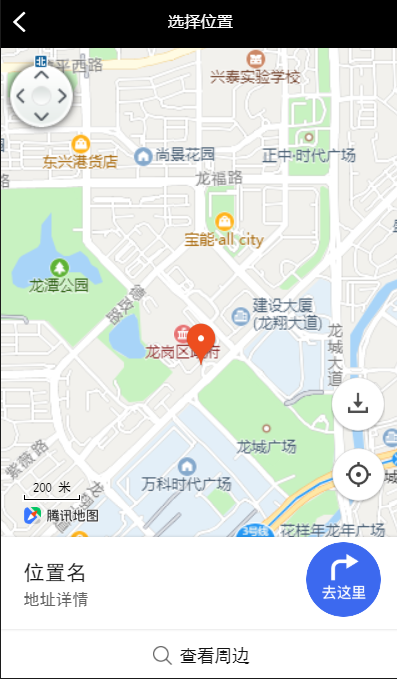
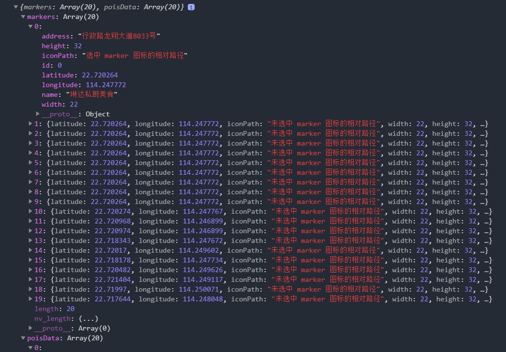

# 使用小程序获取地理位置的API

### 1. 小程序获取位置信息

> 参考 https://www.jianshu.com/p/e232c3c9af37

#### 1.1. 实现流程

+ 获取权限

    >可以使用 ***wx.authorize*** 在调用需授权 API 之前，提前向用户发起授权请求。 这里没有

+ 获取地理位置信息

+ 根据获取到的数据，打开地图


#### 1.2. 实现方法


+ 在 ***app.json*** 中配置

    ```
            "permission": {
                "scope.userLocation": {
                "desc": "你的位置信息将用于小程序位置接口的效果展示"
                }
            },
    ```

    

+ 在 ***xxx.js*** 中 配置

    + 在用户首次进入某页面（需要地理位置授权）时候，在页面进行 ***onLoad***，***onShow*** 时候，进行调用 ***wx.getLocation*** 要求用户进行授权；以后每次进入该页面时，通过 ***wx.getSetting*** 接口，返回用户授权具体信息。

    + 当该标志是 ***underfind***，表示用户初次进入该页面，当该标志是 ***false***，表示用户初次进入该页面拒绝了地理授权，应进行重新要求获取授权。

        

    + 配置代码如下

        ```
            data: {
                location:{}

            /**
            * 生命周期函数--监听页面加载
            */
            onLoad: function (options) {
                wx.getSetting({
                success: (res) => {
                    console.log(JSON.stringify(res))
                    // res.authSetting['scope.userLocation'] == undefined    表示 初始化进入该页面
                    // res.authSetting['scope.userLocation'] == false    表示 非初始化进入该页面,且未授权
                    // res.authSetting['scope.userLocation'] == true    表示 地理位置授权
                    if (res.authSetting['scope.userLocation'] != undefined && res.authSetting['scope.userLocation'] != true) {
                        wx.showModal({
                            title: '请求授权当前位置',
                            content: '需要获取您的地理位置，请确认授权',
                            success: function (res) {
                            if (res.cancel) {
                                wx.showToast({
                                title: '拒绝授权',
                                icon: 'none',
                                duration: 1000
                                })
                            } else if (res.confirm) {
                                wx.openSetting({
                                    success: function (dataAu) {
                                        if (dataAu.authSetting["scope.userLocation"] == true) {
                                        wx.showToast({
                                            title: '授权成功',
                                            icon: 'success',
                                            duration: 1000
                                        })
                                        //再次授权，调用wx.getLocation的API

                                        } else {
                                            wx.showToast({
                                                title: '授权失败',
                                                icon: 'none',
                                                duration: 1000
                                            })
                                        }
                                    }
                                })
                            }
                            }
                        })
                    } else if (res.authSetting['scope.userLocation'] == undefined) {
                    //调用wx.getLocation的API
                    wx.getLocation({
                        success: res => {
                            console.log(res);
                            this.setData({
                                location: res,
                            })
                            //console.log(app.globalData.location);
                        }
                    })
                    }
                    else {
                    //调用wx.getLocation的API
                    wx.getLocation({
                        success: res => {
                        console.log(res);
                        this.setData({
                            location: res,
                        })
                        }
                    })
                    }
                }
                })
            },
        ```
    + 设置函数打开地图

        ```
                openmap : function(){
                wx.openLocation({
                latitude: this.data.location.latitude,
                longitude: this.data.location.longitude,
                scale: 18,
                name:'位置名',
                address: '地址详情'
                })
            }
        ```

    + 实现效果

        

------


### 2. 小程序调用高德地图api获取地理位置信息

> 微信小程序的接口，只能得到经纬度，但有时候我们需要得到具体的城市或者区域信息，这就需要借助高德地图了（或者腾讯地图等，逻辑都是一样的，但百度时间多可以试试）。

> 参考 高德 https://lbs.amap.com/api/wx/gettingstarted

#### 2.1. 实现流程

+ 注册开发者
+ 获取key
+ 配置项目
    + 设置安全通讯域名
    + 下载api 
+ 调用api 获取数据
    + POI数据
    + 地址描述数据
    + 实时天气数据

#### 2.2. 实现方法


##### 2.2.1. 获取key

+ 进入控制台，创建新项目

    

+ 添加新key

    

+ 勾选后，在刚创建的项目下即可看到key

    

##### 2.2.2. 配置项目

+ 设置安全通讯域名

    > 为了保证高德小程序 SDK 中提供的功能的正常使用，需要设置安全域名。

    + 登录微信公众平台(https://mp.weixin.qq.com/)，在 "设置"－>"开发设置" 中设置 ***request*** 合法域名，将 ***https://restapi.amap.com*** 中添加进去

        

    + 测试环境下

        + 开发者工具 - 详情 - 本地设置 - 勾选 不校验

        

+ 下载api https://lbs.amap.com/api/wx/download
  
    + 将解压后得到的 ***amap-wx.js*** 文件拷贝至 项目新建目录 ***libs*** 下

        

##### 2.2.3. 调用api 获取数据

+ ***wxml*** 中使用<map></map>组件渲染地图

+ 在调用api的页面目录下的 ***xxx.js*** 文件中 引用 ***amap-wx.js***

    ```
        var amapFile = require('../../libs/amap-wx.js');
    ```
+ 实例化 ***AMapWX*** 对象

        ```
            var markersData = []; // 实例化AMapWX 对象
        ```

+ 为保证 ***marker*** 以自定义的图标显示，需在项目中新建 ***img*** 目录，并将 ***marker*** 对应的图标拷贝到项目的本地的 ***img*** 目录中，同时在 ***xxx.js*** 添加以下代码：

    ```
        Page({
        data: {

        },
        makertap: function(e) {
            var id = e.markerId;
            var that = this;
            that.showMarkerInfo(markersData,id);
            that.changeMarkerColor(markersData,id);
        },
        showMarkerInfo: function(data,i){
            var that = this;
            that.setData({
            textData: {
                name: data[i].name,
                desc: data[i].address
            }
            });
        },
        changeMarkerColor: function(data,i){
            var that = this;
            var markers = [];
            for(var j = 0; j < data.length; j++){
            if(j==i){
                data[j].iconPath = "选中 marker 图标的相对路径"; //如：..­/..­/img/marker_checked.png
            }else{
                data[j].iconPath = "未选中 marker 图标的相对路径"; //如：..­/..­/img/marker.png
            }
            markers.push(data[j]);
            }
            that.setData({
            markers: markers
            });
        }

        })
    ```

+ 调用 ***getPoiAround*** 方法，获取 ***POI*** 数据。

```
    onLoad: function() {
        var that = this;
        var myAmapFun = new amapFile.AMapWX({key:'您的key'});
        
        // 调用getPoiAround方法，获取Poi数据
        
        myAmapFun.getPoiAround({
        iconPathSelected: '选中 marker 图标的相对路径', //如：..­/..­/img/marker_checked.png
        iconPath: '未选中 marker 图标的相对路径', //如：..­/..­/img/marker.png
        success: function(data){
            markersData = data.markers;
            that.setData({
            markers: markersData
            });
            that.setData({
            latitude: markersData[0].latitude
            });
            that.setData({
            longitude: markersData[0].longitude
            });
            that.showMarkerInfo(markersData,0);
        },
        fail: function(info){
            wx.showModal({title:info.errMsg})
        }
        })
    },
```

+ 获取返回值

    

+ 调用 ***getRegeo*** 方法，获取 ***地址描述数据***

    >onLoad 中

    ```
        myAmapFun.getRegeo({
            success: function (data) {
            //成功回调
            console.log(data)
            },
            fail: function(info){
            //失败回调 
            console.log(info)
            }
        })

    ```

    + 获取返回值

        
        
        
    
+ 调用 ***getWeather*** 方法，获取 ***实时天气数据***

    > onLoad 中
    
    ```
        myAmapFun.getWeather({
            success: function (data) {
            //成功回调
            console.log(data)
            },
            fail: function(info){
            //失败回调
            console.log(info)
            }
        })
    ```
    + 获取返回值

        